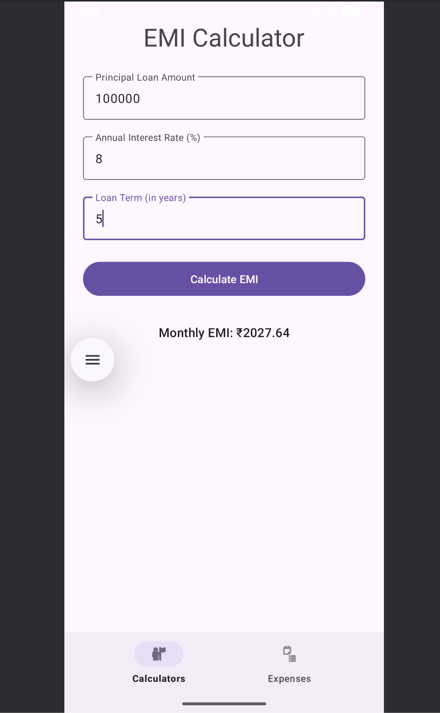
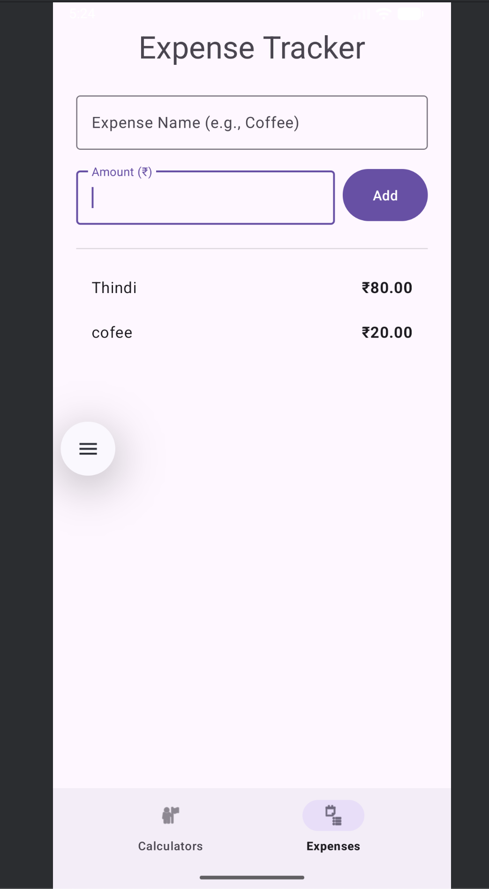

# Financial Management App 📱

A native Android app for personal finance. Includes an EMI calculator and a persistent expense tracker built with Java, Room, RecyclerView, and Material 3.

## 📸 Screenshots

| EMI Calculator | Expense Tracker |
| :---: | :---: |
|  |  |

_Note: You will need to upload your screenshots to your GitHub repository for the images to show up. (Instructions below)_

---

## ✨ Features

* **EMI Calculator:**
    * Calculates the Equated Monthly Installment (EMI) based on principal, interest rate, and loan term.
* **Expense Tracker:**
    * **Add Expenses:** Users can add new expenses with a name and amount.
    * **Persistent Storage:** All expenses are saved to a local **Room Database**, so data is never lost.
    * **Dynamic List:** All saved expenses are displayed in real-time using a **RecyclerView**.
* **Modern UI & Navigation:**
    * Built with **Material Design 3** components (`TextInputLayout`, `MaterialButton`).
    * Features a **BottomNavigationView** to easily switch between different app sections using **Fragments**.

---

## 🛠️ Technologies & Skills Demonstrated

* **Core:** Java, Android SDK
* **UI/UX:** XML, Material Design 3, RecyclerView, Fragments, BottomNavigationView
* **Database:** Room Database (for persistence)
* **Threading:** `ExecutorService` (for background database operations)
* **Architecture:** Multi-Fragment, single-Activity structure
* **Tools:** Android Studio, Gradle

---

## 🚀 How to Build

1.  Clone this repository.
2.  Open the project in Android Studio.
3.  Let Gradle sync the dependencies.
4.  Run the app on an emulator or a physical device.
